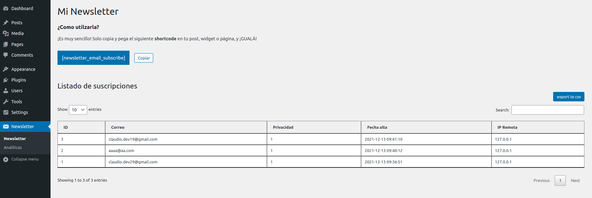

# Mi Newsletter

Un plugin sencillo pero práctico de Newsletter.

## Cómo utilizarlo
1. Instala el plugin
2. Ve a la cofiguración del plugin desde tu Back Office
3. Copia y pega el shortcode en tu página, widget o post.

<strong>Preview:</strong>

